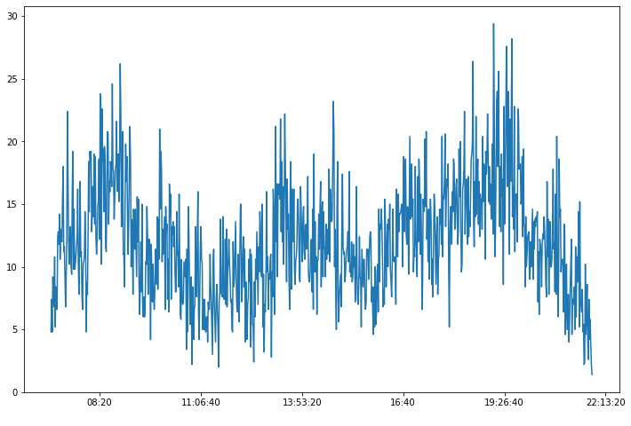
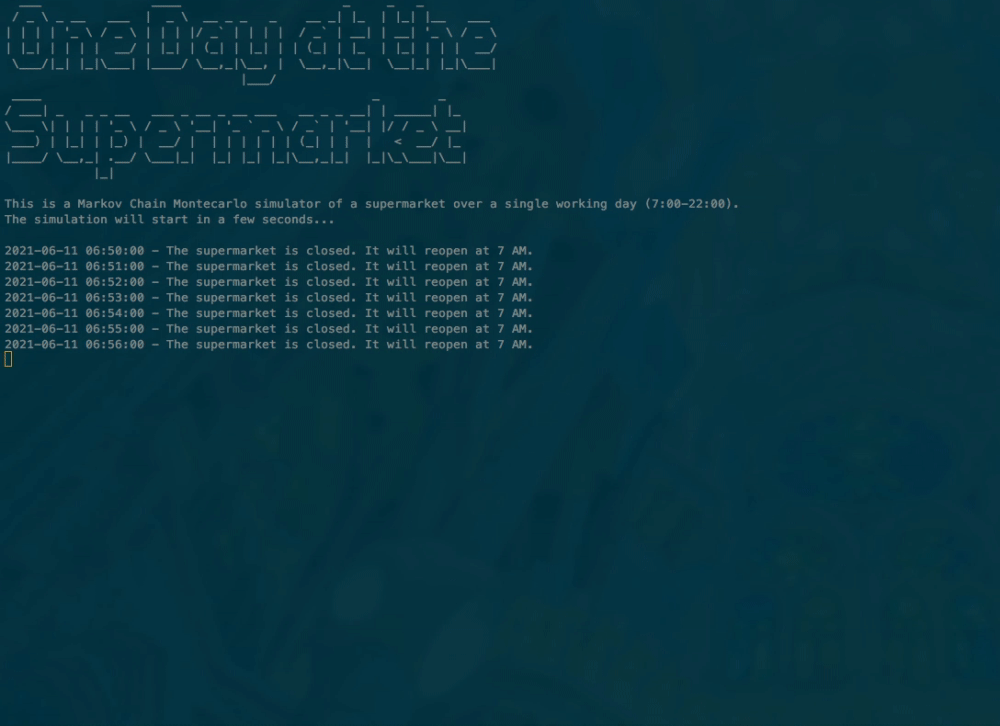

# One Day at the Supermarket

_A project for simulating daily flows and customers' behaviour in a supermarket through a Monte Carlo Markov Chain_

  

This project runs a **Monte Carlo Simulation for predicting customers' behaviour in a fictional supermarket** over a working day. Customers enter the supermarket, freely move through its ailes and then leave the facility.  

|  |
| :----------------------------------------------------------: |
|  <i><b>Fig. 1</b>: The simple architecture of the simulated supermarket</i> |

### Data Set

The data set records the entrance time of each customer into the supermarket; minute by minute, it then follows their path through the ailes of the supermarket and finally to the checkout. 

- The CSV files containing the raw daily data are available under `data/daily_attendance/raw`;
- The clean and reshaped data set used to run the MCMC Simulation may be found under `data/daily_attendance/cleaned_up`.

The user can **follow the various steps of the undertaken data preparation** in the Jupyter Notebook `Exploratory_Data_Analysis.ipynb`. The Notebook also features a few graphics that provide an **insight into the daily flows of customers in the supermarket**.   

|                                    |
| :----------------------------------------------------------: |
|  <i><b>Fig. 2</b>: Rush hours are clearly visible around 9:00, 14:00 and 19:30</i> |

### Monte Carlo Markov Chain
* **Transition Matrix**: Put in a nutshell, the Markov Chain algorithm predicts each customer's next movement based on their last position. This means that each location in the supermarket has to be associated with probabilities for a customer to move from there to any other location (or to remain there). Such a *Transition Matrix* is elaborated in the module `MCMC_Simulation/transition_matrix.py` based on the information extracted from `data/daily_attendance/cleaned_up/clean_final.csv`.
* **Simulator**: The simulation is run by `supermarket.py`. Single customers are simulated as instances of the Python class `Customer`; their location inside the supermarket is updated based on transition matrix. The class `Supermarket` allows customers into the simulation in accordance with the described daily flows (fig. 2). When they reach the checkout, customers are removed from the simulation.  

|                                    |
| :----------------------------------------------------------: |
|  <i><b>Fig. 3</b>: Example simulation</i> |

---

### How To Use This Code
1. Clone this repository and `cd` into it.

2. Install the required Python libraries with `pip install -r requirements.txt`.

3. `cd` into the folder `MCMC_Simulation`. 

4. To launch the simulation, just run `python supermarket.py`! 

   **N.B.** _One simulated minute equals half a second of real life time, which means that one minute in real life time equals two hours in the simulated supermarket. Therefore, once started, **the simulation will run for about seven minutes**._ 

5. You may retrieve the record of each simulation cycle in the folder `MCMC_Simulation/output`. 

---
### Tech Stack

---
### Credits
The code in this repository is an extended and reworked version of the original project developed in collaboration with [Behzad Azarhoushang](https://github.com/behzad1195), [Laura Bartolini](https://github.com/Rellino) and [Vlasis Tritakis](https://github.com/Mimis3).

---
### To Do
- [ ] Provide customers with a budget to spend into the supermarket.
- [ ] Add a tool for the user to visualise the movements of each customer on the supermarket map.
- [ ] Tests.
