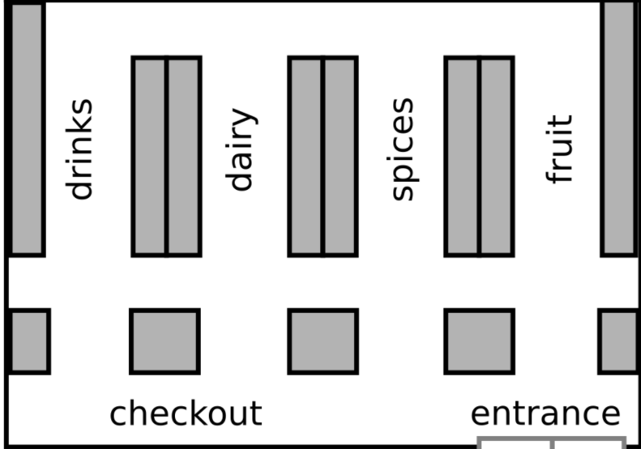

# One Day at the Supermarket

_A project for simulating daily flows and customers' behaviour in a supermarket through a Monte Carlo Markov Chain_

 

This project runs a **Monte Carlo Simulation for predicting customers' behaviour in a fictional supermarket** over a working day. The supermarket has the simple architecture represented in the below picture. Customers enter the supermarket, freely move through its ailes and then leave the facility.  

|  |
| :---: |

---
### Data Set
The data set records the entrance time of each customer into the supermarket; minute by minute, it then follows their path through the ailes of the supermarket and finally to the checkout. 

- The CSV files containing the raw daily data are available under `data/daily_attendance/raw`;
- The clean and reshaped data set used to run the MCMC Simulation may be found under `data/daily_attendance/cleaned_up`.

The user can **follow the various steps of the undertaken data preparation** in the Jupyter Notebook `Exploratory_Data_Analysis.ipynb`. The Notebook also features a few graphics that provide an **insight into the daily flows of customers in the supermarket**.   

|                                    |
| :----------------------------------------------------------: |
| <i>Rush hours are clearly visible around 9:00, 14:00 and 19:30.</i> |

### Simulation
The data set records the entrance time of each customer into the supermarket; minute by minute, it then follows their path through the ailes of the supermarket and finally to the  

|                                    |
| :---: |

---
### How To Use This Code
#### ➡️ &nbsp; On UNIX Systems

If you use MacOs or Linux, clone this repository and `cd` into the folder `recommender_app`. Then follow these simple steps:
1. Install the required Python libraries with `pip install -r requirements.txt`.

2. Generate the NMF trained models by running `python movie_recommender.py`. The process may take a few minutes, but the module also takes care of starting the webapp once the training phase:
   - When your Terminal prints `Now starting the Flask app`, open the address `http://localhost:5000` in your browser for using the webapp, then **follow the instructions on the CLI** to decide whether to enable the automatic retraining of the models based on the ratings provided by the app's users or not.
   
   ⚠️⚠️  On some Linux versions, you may need to `apt install lsof` before running the `movie_recommender` module.
   
3. Once the NMF-model files generated, you can always access the webapp running `python movies_app.py`.

**P.S.**: If you prefer to use `Docker`, just follow the instructions [in the following paragraph](https://github.com/fra-mari/two_movie_recommendation_engines#on-windows).

#### ➡️ &nbsp; On Windows
You may recur to `WSL`, but the simplest way is probably to use `Docker`. All you have to do is:

- `cd` into the folder `recommender_app`.

- Build the image from the provided Dockerfile by running `docker build . -t movies`.

- Create and start a container by running `docker run -ti -p 5000:5000 --name recommender movies`. You will get access to the container's Bash Command Line.

- Run `python movie_recommender.py`. **Refer to [point 2](https://github.com/fra-mari/two_movie_recommendation_engines/blob/main/README.md#how-to-use-this-code) of the previous paragraph** for the next steps and options. The webapp will be available at `http://localhost:5000`.

- To quit the container's environment and CLI, you may use the command `exit`.

  

---
### Tech Stack

---
### Credits
The code in this repository is an extended and reworked version of the original project developed in collaboration with [Behzad Azarhoushang](https://github.com/behzad1195), [Laura Bartolini](https://github.com/Rellino) and [Vlasis Tritakis](https://github.com/Mimis3).

---
### To Do
- [ ] Provide customers with a budget to spend into the supermarket.
- [ ] Add a tool for the user to visualise the movements of each customer on the supermarket map.
- [ ] Tests.
